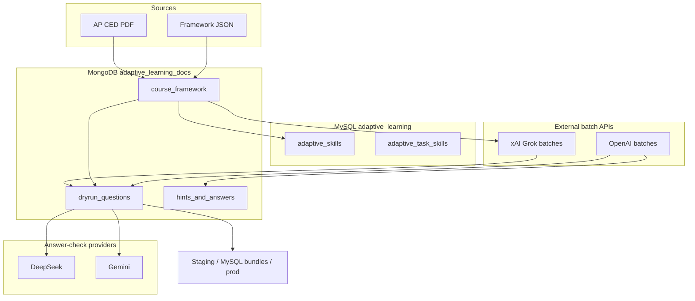
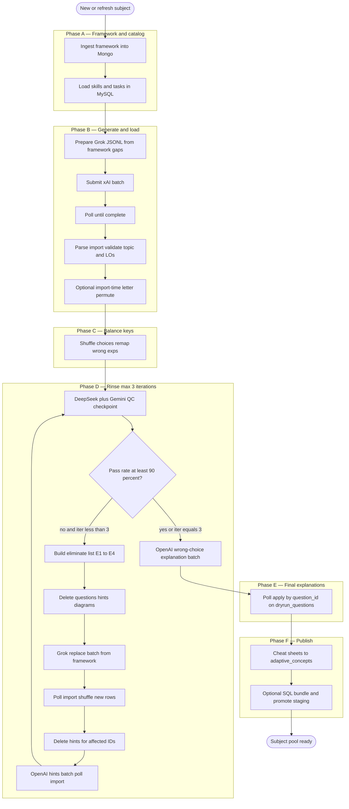
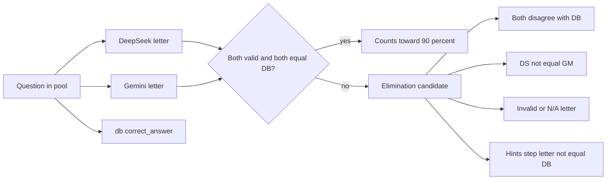
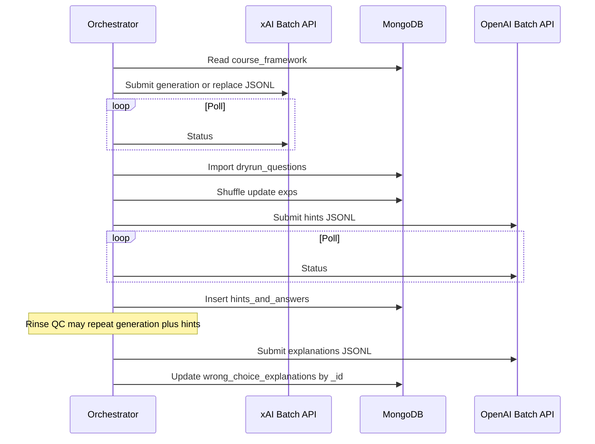

# Subject question pipeline — unified architecture

One pipeline for **AP**, **ACT**, and other MCQ subjects. **Mongo `course_framework`** is the single source of truth for units, topics, and learning objectives. Question documents in `dryrun_questions` match the AP-style contract: `topic`, `matched_topics`, `learning_objectives`, choice explanations, and hints keyed by `question_id`.

Batch work (xAI Grok, OpenAI) always **submit → poll until complete → import**. Quality gate: **DeepSeek + Gemini agree with `correct_answer`** (≥ 90% within 3 rinse iterations).

---

## System context

---

## Layered architecture

| Layer | Responsibility | Repo examples |
|-------|----------------|---------------|
| **Framework** | Parse/insert CED or JSON; validate topic/LO strings | `scripts/ap_ced/extract_ced.py`, `insert_act_math_course_framework.py`, `digital_sat_generation/act_math_framework.py` |
| **Catalog / MySQL** | Skill IDs, task links, package mapping | `ap_ced/load_skills_from_framework.py`, `load_act_math_skills_from_framework.py` |
| **Generation** | Build JSONL from framework gaps; Grok prompts with LO catalog | `prepare_generation_batch.py`, `prepare_act_math_bloom_batch.py` |
| **Import** | Parse batch JSON, LaTeX repair, metadata validate, permute/shuffle hooks, diagrams | `import_generated_questions.py`, `parse_act_math_bloom_batch_results.py` |
| **Balance** | Reduce A–D key bias; remap explanation letter keys | `pipeline/pipeline_utils/shuffle_choices.py`, `permute_act_math_mcq_to_target_answer` |
| **Rinse** | Dual-model QC, eliminate, regen replace, re-score | `scripts/act_math_rinse_cycle.py`, `rinse_quality.py`, `run_rinse_provider_qc.py` |
| **Polish** | Hints/step-by-step; wrong-choice explanations **last** | `batch_ai_submit/run_batch_generation.py`, `submit_act_math_hints_batch.py`, `submit_act_math_explanation_batch.py` |
| **Publish** | Cheat sheets, SQL bundles, promote | `generate_cheatsheets.py`, `generate_*_mysql_bundle.py`, promote scripts |

**Subject adapter:** small config (subject name, skill IDs, prepare/parse script names, collection). Core phases are identical.

---

## End-to-end flow (single mode)

Wrong-choice explanations run **after** rinse and hints so `correct_answer` and choice text are stable. Grok may omit wrong exps on first pass; placeholders are filled in the final OpenAI explanation batch.

---

## Data contract (question document)

Every loaded question should converge to this shape (field names stable for UI and review):

| Field | Type | Source |
|-------|------|--------|
| `subject`, `skill`, `skill_id`, `level`, `level_num` | taxonomy | Framework + generation manifest |
| `topic` | string | Framework topic name (validated) |
| `matched_topics` | string[] | Typically `[topic]` |
| `learning_objectives` | string[] | 1–3 framework objective **descriptions** |
| `question`, `multiple_choices`, `correct_answer` | MCQ | Grok |
| `correct_choice_explanation` | object | Grok and/or OpenAI |
| `wrong_choice_explanations` | map A–D | Final OpenAI batch (after rinse) |
| `requires_diagram`, `figure_spec` | optional | Grok + render step |

Hints live in **`hints_and_answers`** keyed by `question_id` (ObjectId), not embedded in the question doc.

---

## Rinse decision logic

Diagrams use the **same** pass/fail rules as text (`treat_diagram_as_normal=True`).

---

## Batch and state conventions

- **State files:** e.g. `pipeline/review_reports/<subject>_rinse_state.json` (batch IDs, iteration, pass rate).
- **Poll:** never require manual “batch done” in automated runs; CLI `--poll` for recovery.
- **Regeneration:** delete bad questions and hints; do not patch hint documents in place.

---

## Conflict resolution (when “corrections” are needed)

| Symptom | Action | Avoid |
|---------|--------|--------|
| Hint `final_answer` ≠ `correct_answer` | Flag; next rinse **regenerate question** (E4) | Auto-change `correct_answer` to match hint |
| DS/Gemini disagree with DB | Rinse eliminate → Grok replace | Single-model override without regen |
| Explanation cites wrong letter after shuffle | Remap on shuffle or re-run explanation batch | Manual letter edits without remap |
| Missing `learning_objectives` | Tag batch against framework catalog | Invent LO text outside framework |

---

## Command map (reference)

| Phase | Typical entrypoints |
|-------|---------------------|
| Framework | `scripts/ap_ced/extract_ced.py`, `scripts/insert_act_math_course_framework.py` |
| Skills | `scripts/ap_ced/load_skills_from_framework.py`, `scripts/load_act_math_skills_from_framework.py` |
| Generate | `prepare_generation_batch.py`, `prepare_act_math_bloom_batch.py`, `submit_generation_batch.py` |
| Import | `import_generated_questions.py`, `parse_act_math_bloom_batch_results.py` |
| LO backfill | `scripts/backfill_act_math_learning_objectives.py` |
| Shuffle | `pipeline/pipeline_utils/shuffle_choices.py`, `scripts/shuffle_act_math_choices.py` |
| Rinse | `scripts/act_math_rinse_cycle.py`, `docs/UNIVERSAL_QUESTION_RINSE.md` |
| Hints | `adaptive-learning-utils/batch_ai_submit/run_batch_generation.py`, `submit_act_math_hints_batch.py` |
| Explanations | `submit_act_math_explanation_batch.py`, `run_batch_wrong_choices.py` (AP utils) |
| Cheat sheets | `pipeline/generate_cheatsheets.py --subject "<Subject>" --unit "*"` → `adaptive_concepts` |

Future work: one orchestrator CLI (`subject_pipeline run --config configs/ap_chemistry.yaml`) that reads subject adapter config and runs phases A–F with shared poll/state.

---

## Related docs

- [`UNIVERSAL_QUESTION_RINSE.md`](UNIVERSAL_QUESTION_RINSE.md) — rinse rules and iteration cap  
- [`ACT_MATH_RINSE_CYCLE.md`](ACT_MATH_RINSE_CYCLE.md) — ACT-specific commands (instance of this architecture)  
- [`.cursor/skills/load-ap-subject/SKILL.md`](../.cursor/skills/load-ap-subject/SKILL.md) — AP operational checklist (shuffle before hints; Grok may include wrong exps on first pass)
